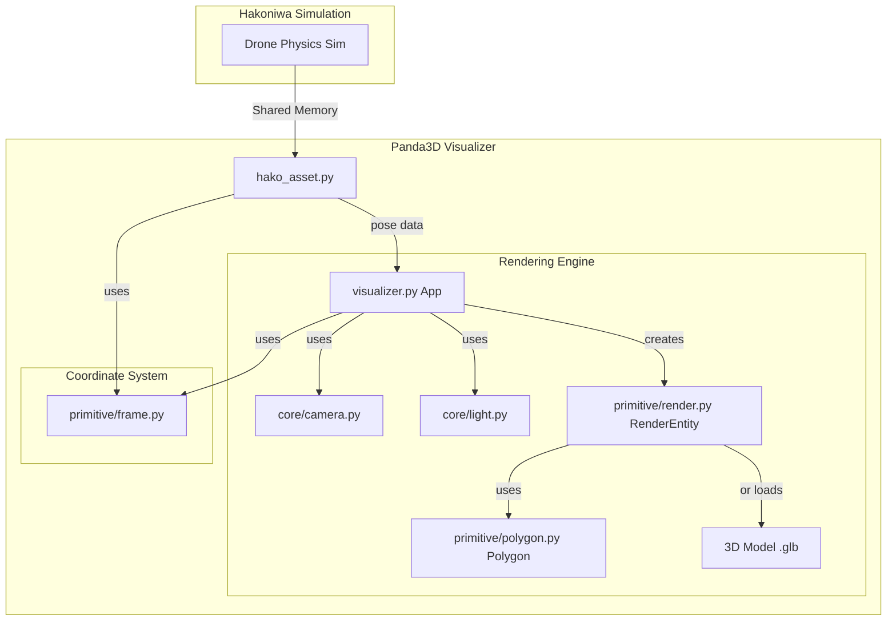

# Hakoniwa Panda3D Drone Visualizer

## 概要

このプロジェクトは、[箱庭ドローン](https://hakoniwa-lab.net/products/drone/)シミュレーションのための3Dビジュアライザです。Panda3Dエンジンを使用し、シミュレーション中のドローンの位置、姿勢、ローターの回転などをリアルタイムに可視化します。

## 主な機能

*   箱庭ドローンの物理エンジンと連携したドローンのリアルタイム3D表示
*   JSONファイルによるドローンモデルの柔軟な設定
*   マウス操作によるインタラクティブなカメラ（オービット、パン、ズーム）
*   影を含むシンプルなライティング
*   共有メモリを利用したHakoniwaとの高速なデータ連携

## 前提条件

本シミュレータを実行するには、以下の環境が必要です。

*   Python 3.12.3
*   [Panda3D](https://www.panda3d.org/manual/): 3Dエンジン本体。詳細は公式マニュアルを参照してください。
*   Hakoniwa関連のコンポーネント: `hakoniwa-drone-core` と `hakoniwa-envsim` を事前にセットアップしておく必要があります。詳細は各リポジトリの`README`を参照してください。
*   必要なPythonライブラリ:
    *   `panda3d`
    *   `panda3d-gltf`
    *   `hakoniwa-pdu`

## セットアップ手順

1.  **環境変数の設定:**
    `launch.bash`スクリプト内で、ご自身の環境に合わせて以下の環境変数を設定してください。**注意:** 以下のパスはあくまで開発者環境の一例です。ご自身の環境に合わせて適切に変更してください。
    *   `HAKO_DRONE_PROJECT_PATH`: [hakoniwa-drone-core](https://github.com/toppers/hakoniwa-drone-core) プロジェクトのパス
    *   `HAKO_ENVSIM_PATH`: [hakoniwa-envsim](https://github.com/hakoniwalab/hakoniwa-envsim) プロジェクトのパス
    *   `PYTHON_PATH`: Python実行可能ファイルのパス
    *   `HAKO_PANDA3D_DRONE_PATH`: このリポジトリのパス

2.  **Pythonライブラリのインストール:**
    ```bash
    pip install -r requirements.txt
    ```

## 実行方法

`launch.bash`スクリプトに必要な設定ファイルを与えて実行します。

```bash
bash launch.bash launcher_config/drone-rc-mac.launch.json
```

これにより、箱庭シミュレータの各アセット（ドローン本体、環境、Panda3Dビジュアライザ、RC）が起動します。

### 期待される結果

コマンドが成功すると、灰色の床の上にドローンが表示された3Dウィンドウが起動します。以下のようなマウス操作でカメラを動かすことができます。

*   **オービット（回転）:** Alt + 左ドラッグ、または 右ドラッグ
*   **パン（平行移動）:** 中ドラッグ
*   **ズーム:** マウスホイール

## 設定ファイルについて

### ドローンモデル定義 (`drone_config.json`)

ビジュアライザで表示するドローンの外観を定義するJSONファイルです。ドローン本体と、それに付属するパーツ（子要素）を階層的に記述できます。

```json
{
  "name": "drone_model",
  "model": "../models/drone.glb",
  "pos": [0, 0, 0.01],
  "hpr": [180, 180, 0],
  "children": [
    {
      "name": "drone_rotor1",
      "model": "../models/prop-1.glb",
      "pos": [0.062, 0.065, -0.01]
    }
  ]
}
```

**主なキーの説明:**

*   `name` (string): エンティティの一意な名前です。
*   `model` (string): 表示に使用する3Dモデルファイルへのパスです（`.glb`形式を推奨）。このパスは実行時のカレントディレクトリからの相対パス、あるいは絶対パスで指定します。ユーザの環境に合わせて適宜修正してください。
*   `pos` (array of float): 親エンティティからの相対的な初期位置 `[x, y, z]` を指定します。
*   `hpr` (array of float): 初期姿勢を `[Heading, Pitch, Roll]` の順で度単位で指定します。

これらの値はPanda3Dの座標系（+X:右, -Y:前, +Z:上）に従います。
*   `children` (array of objects): 子エンティティのリストです。各オブジェクトは親と同じ構造を持ち、`pos`や`hpr`は親からの相対的な値となります。ローターのように、本体に追従して動くパーツの定義に使用します。

### ランチャー設定 (`drone-rc-mac.launch.json`)

シミュレーションを構成する各アセットの起動コマンド、引数、タイミングなどを定義します。
詳細なフォーマットについては、[HAKONIWA Launcherのドキュメント](https://github.com/hakoniwalab/hakoniwa-pdu-python?tab=readme-ov-file#-hakoniwa-launcher)を参照してください。
## ライセンス

このプロジェクトは [LICENSE](./LICENSE) ファイルに記載されたライセンスに基づいています。

## アーキテクチャ概要

本ビジュアライザは、Hakoniwaとのデータ連携部分とPanda3Dによる描画部分を分離した設計になっています。



*   **`hako_asset.py`**: Hakoniwaとのインターフェースです。共有メモリを介してドローンの姿勢データ（`Twist`型）を定期的に読み出します。箱庭PDUのデータはROS座標系（+X:前, +Y:左, +Z:上）であるため、`frame.py`を用いてPanda3Dの座標系に変換し、`visualizer.py`に渡します。
*   **`visualizer.py`**: Panda3Dのメインアプリケーションです。シーンの初期化、ライトやカメラのセットアップを行います。`hako_asset.py`から受け取ったドローンの姿勢を、`RenderEntity`に適用して画面を更新します。
*   **`core/`**: カメラ(`OrbitCamera`)やライト(`LightRig`)など、シーンを構成する基本的な要素を管理します。
*   **`primitive/`**: 描画の最小単位を管理するモジュール群です。この部分を拡張することで、新しい形状を簡単に追加できます。

### `primitive`の拡張方法

`primitive`は、手続き的に生成される形状（ポリゴン）と、それを描画するためのエンティティから構成されます。新しい形状を追加するには、`Polygon`クラスを継承します。

**例：四角錐（Pyramid）の追加**

1.  **`primitive/polygon.py`に新しいクラスを追加**

    `Polygon`を継承し、`__init__`内で頂点(`vtx`)、三角形のインデックス(`tris`)、法線(`normals`)、頂点カラー(`colors`)を定義します。

    ```python
    class Pyramid(Polygon):
        def __init__(self, size: float = 0.5, color: Color = (0.8, 0.2, 0.2, 1.0)):
            s = size * 0.5
            # 5頂点 (底面4 + 頂点1)
            self.vtx: List[Vec3] = [
                Vec3(-s, -s, 0), Vec3(s, -s, 0), Vec3(s, s, 0), Vec3(-s, s, 0), # 底面
                Vec3(0, 0, s * 1.5) # 頂点
            ]
            # 6三角形 (底面2 + 側面4)
            self.tris: List[Tuple[int,int,int]] = [
                (0, 1, 2), (0, 2, 3), # 底面
                (0, 4, 1), (1, 4, 2), (2, 4, 3), (3, 4, 0) # 側面
            ]
            self.colors: List[Color] = [color] * 5
            # (法線の計算はCubeの実装を参考に省略)
            self.normals = [Vec3(0,0,1)] * 5 # 仮
    ```

2.  **`visualizer.py`で使用**

    作成したクラスをインポートし、`RenderEntity`に`set_polygon`で渡すことで、シーンにオブジェクトが描画されます。

    ```python
    from hakoniwa_panda3d_drone.primitive.polygon import Pyramid # インポート

    # ... Appの__init__内などで ...
    my_pyramid_entity = RenderEntity(self.render, "my_pyramid")
    my_pyramid_entity.set_polygon(Pyramid(size=0.3))
    my_pyramid_entity.set_pos(1, 1, 0)
    ```
